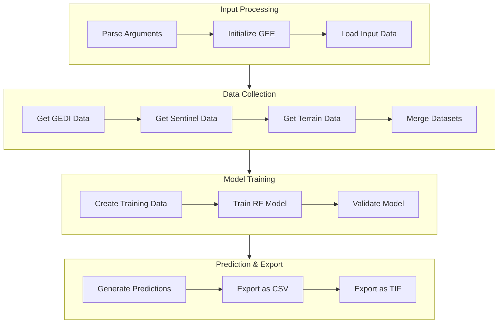

# Canopy Height Mapper Implementation Plan

## Overview
Create a new `chm_main.py` file that combines functionality from `new_ch_gee_main.py` and `query_gee_pixel.py` with enhanced input/output capabilities for CSV and TIF formats.

## Architecture

## Core Components

### 1. Input Processing
- Command line argument parsing for:
  - Input data paths (GEDI, auxiliary data)
  - Output paths for CSV for points training data and TIF files for mapping with RF
  - Model parameters and configuration
  - Processing options
- Earth Engine initialization with proper authentication
- Input validation and data preprocessing

### 2. Data Collection
- GEDI data processing:
  - Loading from specified sources
  - Filtering and quality checks
  - Coordinate system handling
- Sentinel data acquisition:
  - S1 and S2 data collection
  - Cloud masking and compositing
  - Band selection and preprocessing
- Terrain data integration
- Dataset merging and alignment

### 3. Model Training
- Training data preparation:
  - Feature engineering
  - Train/validation split
  - Data normalization
- Random Forest model configuration:
  - Hyperparameter handling
  - Model training
  - Performance validation
  - Metrics calculation
  - Use sklearn instead of using ee.classifier 

### 4. Prediction & Export
- Prediction generation
- CSV export functionality:
  - Training data export
  - Model predictions export
  - Validation results export
- TIF export capabilities:
  - Canopy height map export
  - Uncertainty metrics export
  - Proper georeference handling

## Key Differences from Existing Code

### Added Features
1. Enhanced I/O Operations
   - CSV format support for training data
   - TIF format support for spatial outputs
   - Flexible input data handling

2. Improved Processing Flow
   - Streamlined data collection
   - Efficient memory management
   - Progress tracking
   - Enhanced error handling

3. Extended Functionality
   - Support for pre-trained models
   - Additional validation metrics
   - Uncertainty estimation
   - Batch processing capability

### Modified Components
1. Data Processing
   - Adapted GEDI processing from query_gee_pixel.py
   - Enhanced Sentinel data handling
   - Improved terrain data integration

2. Model Training
   - Flexible model parameter handling
   - Enhanced validation procedures
   - Additional performance metrics

3. Export Functions
   - New CSV export methods
   - TIF file generation
   - Progress reporting
   - Error handling

## Implementation Steps

1. Initial Setup
   - Create file structure
   - Set up imports
   - Implement argument parsing

2. Core Functionality
   - Implement data collection methods
   - Develop model training framework
   - Create export utilities

3. Integration
   - Combine components
   - Add error handling
   - Implement logging

4. Testing & Validation
   - Unit tests
   - Integration tests
   - Performance validation

## Next Steps

1. Create chm_main.py file structure
2. Implement core functionality
3. Add export capabilities
4. Integrate with existing codebase
5. Test and validate